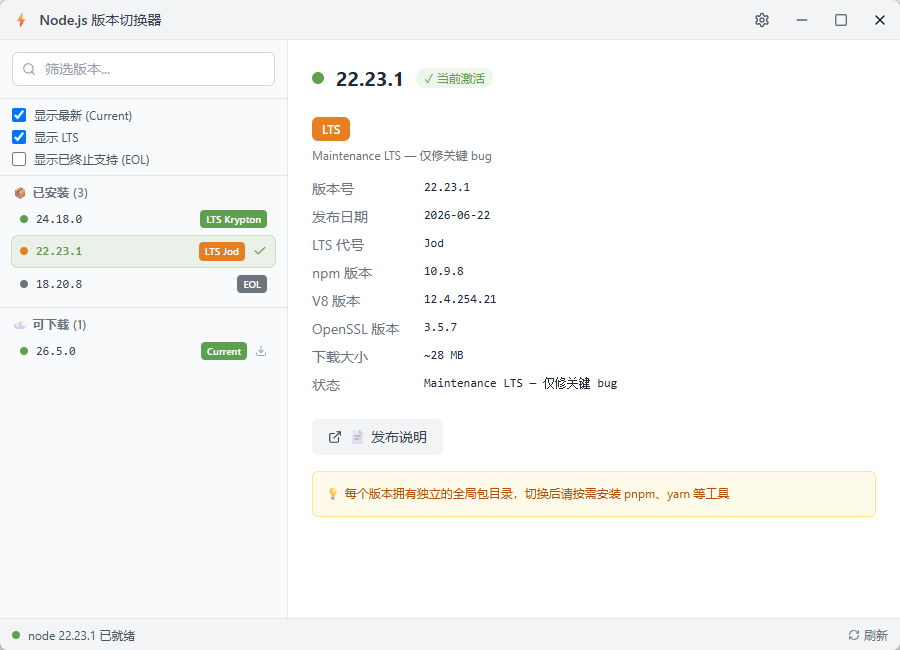
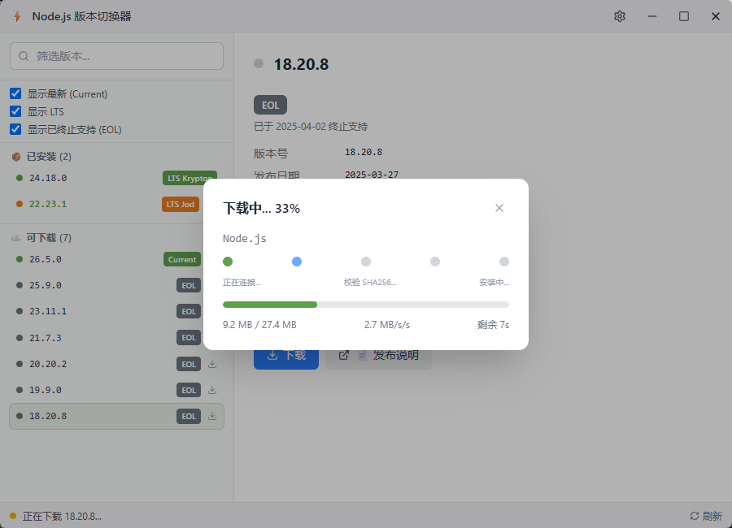
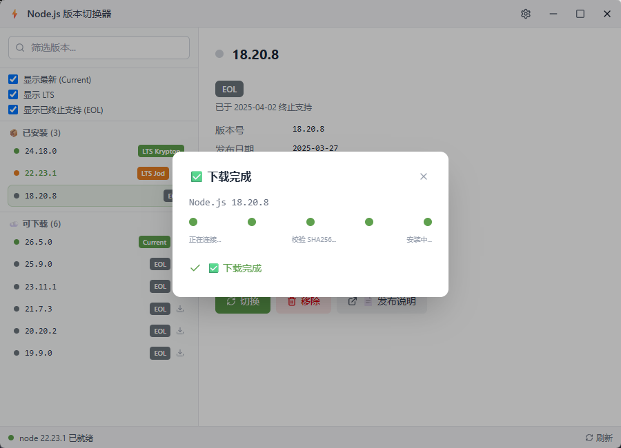
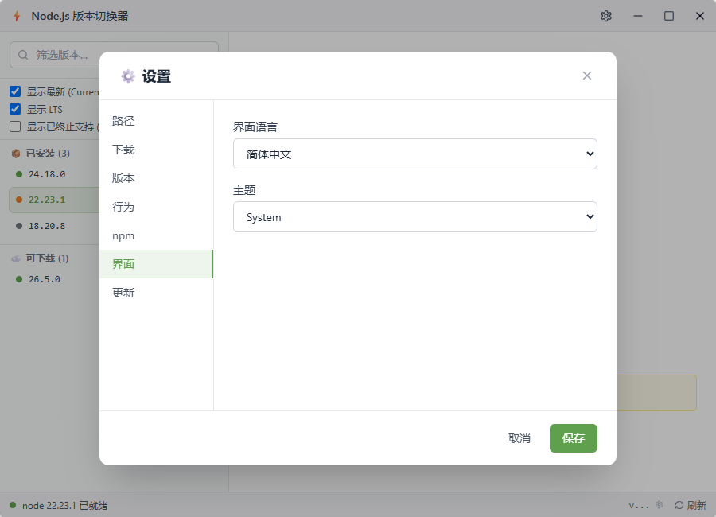

# Node.js バージョン切替

**switch-node** — ポータブル版 Node.js のダウンロード・インストール・切替をワンストップで行うデスクトップアプリ。

[English](README.md) | [简体中文](README_zh-CN.md)

## 機能

- 📦 複数バージョンの Node.js を一括管理（ポータブル zip 版）
- 🔀 ジャンクション（`mklink /J`）による瞬時切替（管理者権限不要）
- 📥 内蔵ダウンロード（SHA256 検証 + 展開）
- 🌐 ミラー対応（nodejs.org / npmmirror.com / カスタム）
- 🎨 LTS / Current / EOL の分類と色分け表示
- 🌍 日本語・簡体字中国語・英語 UI
- 🔄 GitHub Releases による自動更新

## スクリーンショット



| ダウンロード中 | ダウンロード完了 | 設定 |
|---|---|---|
|  |  |  |

## インストール

[Releases](https://github.com/wangjianguo0405/switch-node/releases) から最新の `switch-node.exe`（ポータブル版、インストール不要）をダウンロードしてください。

## 使い方

1. アプリを起動する（初回はセットアップウィザードが開きます）
2. ダウンロードしたい Node.js バージョンを選択 → 「ダウンロード」
3. ダウンロード完了後、「切替」をクリック
4. ターミナルで `node -v` を実行して確認

### 設定

- **nodeRoot** — Node.js のインストール先（デフォルト: `D:\Program Files\nodejs`）
- **ミラー** — ダウンロード元（nodejs.org / npmmirror.com / カスタム）
- **npm ミラー** — `npm config set registry` を自動実行
- **自動更新** — GitHub Owner/Repo を設定すると更新チェックが有効

## 開発

```bash
# 依存関係のインストール
npm install

# 開発モード（Rust + フロントエンド）
npm run tauri dev

# プロダクションビルド
npm run tauri build

# TypeScript 型チェック
npx tsc --noEmit

# Rust チェック
cargo check --manifest-path src-tauri/Cargo.toml
```

### 技術スタック

| 層 | 技術 |
|---|---|
| フロントエンド | React 19, TypeScript, Tailwind CSS 4, Zustand 5, Vite 6 |
| バックエンド | Rust, Tauri 2.x, reqwest, zip, sha2, tokio |
| デスクトップ | Tauri 2.x |

## ライセンス

MIT
